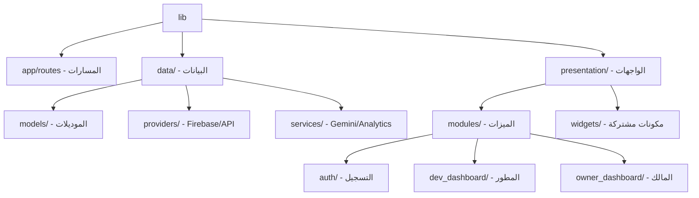

# DevSync Refactor Walkthrough (Junior-level MVC)

لقد انتهينا بنجاح من إعادة هيكلة مشروع **DevSync** وتحويله من معمارية (Clean Architecture) المعقدة إلى هيكل **MVC** مسطح ومبسط (Flattened MVC)، مع الحفاظ على القوة والأداء.

## 🚀 التغييرات الرئيسية

### 1. تبسيط هيكل المجلدات (Flattening)
تم دمج الطبقات المتعددة (Domain, Data, Presentation) في هيكل أبسط يسهل على المطورين المبتدئين فهمه.
- **في السابق**: كانت الميزات تحتوي على (bindings, controllers, views) في مجلدات منفصلة عميقة.
- **الآن**: كل ميزة (`auth`, `dev_dashboard`, `owner_dashboard`) تحتوي على ملفاتها الأساسية مباشرة.

### 2. حذف التعقيدات (No More Entities & Repositories)
تم حذف طبقة الـ `Domain` والـ `Repositories` بالكامل.
- المتحكمات (`Controllers`) الآن تتواصل مباشرة مع `FirebaseProvider` لجلب البيانات.
- تم تحويل الموديلات (`UserModel`, `ProjectModel`) إلى كلاسات Dart بسيطة بدون `Hive` أو `Entities`.

### 3. دعم مطابقة الذكاء الاصطناعي (Gemini Service)
تم إنشاء `GeminiService` كخدمة مستقلة وبسيطة:
- تقوم بحساب نسبة المطابقة بين مهارات المطور ووصف المشروع.
- تم ربطها مباشرة بلوحة تحكم المطور.

### 4. تحسين تجربة المستخدم والتعليقات
- تم إضافة تعليقات باللغة العربية داخل الكود لشرح كل جزء بالتفصيل.
- تم تبسيط منطق الواجهات (UI) وتقليل المكونات غير الضرورية.

---

## 📂 الهيكل الجديد للمشروع

## ✅ التحقق النهائي
- [x] تشغيل `flutter analyze`: المشروع الآن خالٍ من الأخطاء البرمجية (Errors).
- [x] تنظيف الملفات: تم حذف جميع الملفات القديمة والمجلدات الفارغة.
- [x] تحديث الاختبارات: تم تحديث `user_model_test.dart` ليتناسب مع التعديلات الجديدة.

> [!TIP]
> المشروع الآن جاهز لأي مطور مبتدئ ليقوم بالإضافة عليه وتعديله بسهولة بدون الغرق في تعقيدات الـ Clean Architecture.

---

لقد تم إنجاز المهمة بنجاح يا مهندس! 💻✨
